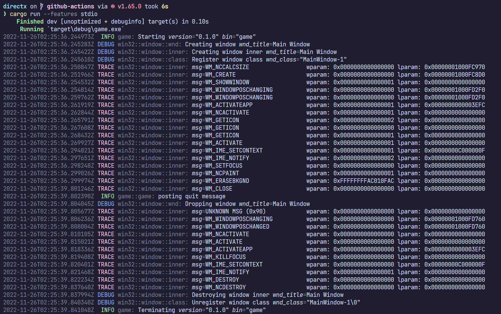

# directx

A small DirectX project in Rust. The project consists of a `::win32` library to
abstract FFI details behind an somewhat idiomatic interface, together with a
`::game` binary which serves as a simple test-bed for the library.

## Requirements

- Windows OS
- Direct3D 11 graphics card support

## Building

To build and run the example, a simple cargo run suffices:

```powershell
cargo run
```

### Tracing Support

Both the `::win32` library and the example binary are instrumented with tokio's
excellent [`::tracing`](https://github.com/tokio-rs/tracing) library.

To enable tracing, the project must be built with the `stdio` feature. The
`stdio` feature flag changes the project from a Windows subsystem to a Console
subsystem and ensure that stdin/stdout/stderr are attached to the process.

Set the appropriate tracing level environment variable and execute the program
from the command line to view trace output:

```powershell
$env:RUST_LOG = "trace"
cargo run --features stdio
```

#### Example



