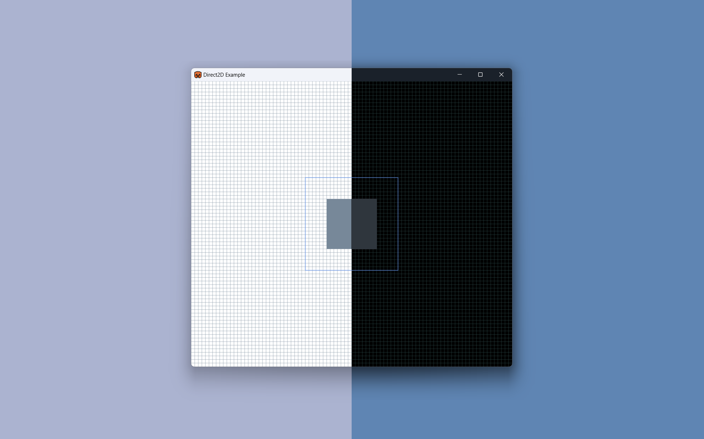

# D2D

`::d2d` is a low level hardware accelerated 2D graphics package powered by
Microsoft [Direct2D] intended for use with native Win32 applications.

Only the minimal of conveniences are provided over the underlying [Direct2D]
implementation in order to provide safe and idiomatic rust APIs without
sacrificing performance. Where feasible, primitive types share a memory layout
with their [Direct2D] counterparts to ensure the rust niceties are zero-cost
conveniences.

## Requirements

- Windows 11 or newer
- DirectX 10 capable graphics card

> **Note**
>
> No C++ redistributable, installers or .NET runtime is required. `::d2d`
> builds directly on the Win32 and DirectX layer and can be used to create
> standalone binaries that run with no other resources.

## High-DPI Support

`::d2d` is DPI aware and supports modern [High-DPI] rendering for crisp visuals
on high resolution or scaled displays.

To enable support, your app must bundle an [application manifest] (also known as
a side-by-side application manifest) with the correct entries to declare DPI
awareness.

See the [examples] directory for an example manifest ([hdpi.manifest]) which
contains all the necessary attributes. An [application manifest] must be
compiled into your binary - a process which is significantly easier when you use
Visual Studio proper. For a pure rust method of compiling & bundling
application manifests, the crate [`::winres`] is excellent and can be set to run
as a build script phase. For an example, see [`build.rs`] in this repository.

## Example

[Example](example/src/main.rs) shown in light and dark mode.



```rust
/// Draw the main window contents. This is a simple example of Direct2D
/// drawing and will paint the following:
///
/// - An 8x8 (density independent pixel) gray grid
/// - A large outline of a rectangle in the center
/// - A smaller filled rounded rectangle within the stroked rect
fn draw(&mut self) {
    // Drawing must always begin with a `begin_draw` call. All drawing is
    // done via the returned `Context`, and our render target is held locked
    // until the corresponding `end_draw` call.
    let mut ctx = self.render_target.begin_draw();
    // Erase the last contents by paining the client area white.
    ctx.clear(self.resources.background_color);

    // Cache our main window dimensions both as i32 and f32 values.
    let dimensions = self.main_window.size().cast::<f32>();

    // Draw grid with 8px squares
    let stroke_width = 0.5;
    for x in (0..self.main_window.size().width)
        .step_by(8)
        .map(|u| u as f32)
    {
        ctx.draw_line(
            Point2D { x, y: 0.0 },
            Point2D {
                x,
                y: dimensions.height,
            },
            stroke_width,
            &mut self.resources.grid_brush,
        );
    }
    for y in (0..self.main_window.size().height)
        .step_by(8)
        .map(|u| u as f32)
    {
        ctx.draw_line(
            Point2D { x: 0.0, y },
            Point2D {
                x: dimensions.width,
                y,
            },
            stroke_width,
            &mut self.resources.grid_brush,
        );
    }

    // Draw two rectangles, one inner filled rectangle and one stroked
    // larger rectangle.
    ctx.fill_rect(
        Rect2D {
            left: (dimensions.width / 2.0 - 56.0),
            right: (dimensions.width / 2.0 + 56.0),
            top: (dimensions.height / 2.0 - 56.0),
            bottom: (dimensions.height / 2.0 + 56.0),
        },
        &mut self.resources.rect_fill_brush,
    );
    let stroke_width = 1.0;
    ctx.stroke_rect(
        Rect2D {
            left: (dimensions.width / 2.0 - 104.0),
            right: (dimensions.width / 2.0 + 104.0),
            top: (dimensions.height / 2.0 - 104.0),
            bottom: (dimensions.height / 2.0 + 104.0),
        },
        &mut self.resources.rect_stroke_brush,
        stroke_width,
    );

    // Drawing must end with `end_draw`. This causes the batched changes to
    // be pushed to the hardware and drawn to the screen. It also releases
    // the lock on the render target which is required before any subsequent
    // draw calls.
    ctx.end_draw();
}
```

## Advanced Topics

### Hardware-Bound Resources/Generations

One of the more difficult aspects of dealing with hardware accelerated drawing
technologies like [Direct2D] is [handling loss of the graphics adapter] and the
effects this has on any software resources bound to the hardware resources.
Hardware errors or changes can result in an invalidation of the resources and
objects in software and require you to rebuild render targets and drawing
assets.

[Direct2D] developers know this scenario as the [`D2DERR_RECREATE_TARGET`]
situation, and it can happen at any time. In Rust, this makes managing objects
and their lifetimes especially hard as drawing resources may become invalid at
any time in a way that the compiler is unable to verify.

`::d2d` handles these scenarios automatically internally, and a drawing object
or `::d2d::RenderTarget` never needs to be recreated. Behind the scenes, this is
achieved by assigning every hardware-device-specific resource a generation
identifier and automatically recreating objects which are detected as belonging
to a previous hardware state.

### Threading & COM Model

- `::d2d` operates the [Direct2D] instances in single threaded mode. Concurrency
can be achieved by constructing a new `::d2d::Factory` on each thread which can
render independently. This approach generally scales better than a multithreaded
[Direct2D] instance, and it better matches the threading model used by `Win32`
windows which generally requires application Windows to be interacted with
solely by the thread that created them.
- The [COM] library is initialized to use [single-threaded] apartments.


## License

This project is licensed under the [MIT license].

### Attributions

- [Ferris emoji by dzuk] app icon used in the examples, licensed CC BY‑NC‑SA.

### Contribution

Unless you explicitly state otherwise, any contribution intentionally submitted
for inclusion in this repository by you, shall be licensed as MIT, without any
additional terms or conditions.

[examples]: examples
[`build.rs`]: build.rs
[hdpi.manifest]: hdpi.manifest
[MIT license]: LICENSE
[Direct2D]: https://learn.microsoft.com/en-us/windows/win32/direct2d/direct2d-overview
[High-DPI]: https://learn.microsoft.com/en-us/windows/win32/direct2d/direct2d-overview
[application manifest]: https://learn.microsoft.com/en-us/windows/win32/sbscs/application-manifests
[handling loss of the graphics adapter]: https://learn.microsoft.com/en-us/previous-versions/windows/apps/dn458383(v=win.10)
[single-threaded apartments]: https://learn.microsoft.com/en-us/windows/win32/com/single-threaded-apartments
[`D2DERR_RECREATE_TARGET`]: https://learn.microsoft.com/en-us/windows/win32/direct2d/direct2d-error-codes
[COM]: https://learn.microsoft.com/en-us/windows/win32/com/the-component-object-model
[`::winres`]: https://crates.io/crates/winres
[Ferris emoji by dzuk]: https://weirder.earth/@dzuk/102711286545743862
